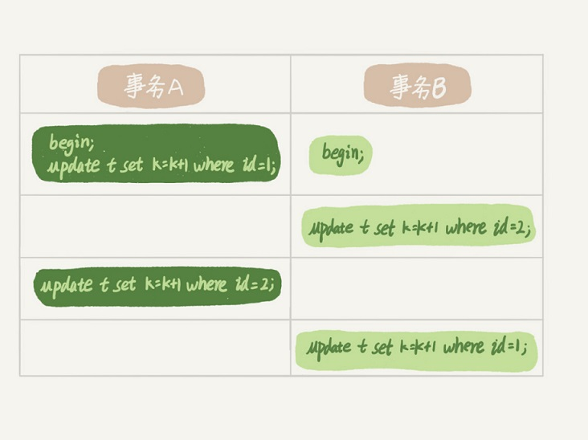

# 07 | 行锁

### 1、行锁
>顾名思义，行锁就是针对数据表中行记录的锁。这很好理解，比如事务 A 更新了一行，而这个时候事务B也要更新同一行，则必须等事务A执行完才能更新。

### 2、两阶段
**`在InnoDB 事务中，行锁是在需要的时候才加上的，丹并不是不需要了就立刻释放，而是要等到事务结束了才释放，这个就是两阶段协议`**

> 如果业务中的事务需要处理多个行，最可能造成锁冲突、最可能影响并发度的锁尽量往后放。

### 3、死锁和死锁检测
> 当并发系统中不同线程出现资源依赖，涉及的线程都在等待别的线程释放资源时，就会导致几个线程都进入无线等待的状态，称为死锁。

>事务A在等待事务B释放id= 2的行锁，而事务B在等待事务A释放id = 1的行锁，
事务A和事务B在互相等待对方的资源释放，就是进入死锁的状态，当出现死锁后，有两种策略:  
- 直接进入等待，直到超时，通过innodb_lock_wait_timeout 来设置，默认值50s
- 发起死锁检测，一旦发现死锁，主动回滚链条中的某一事务，让其他事务继续执行，将参数innodb_deadlock_detect 设置为on  表示开启这个逻辑。

